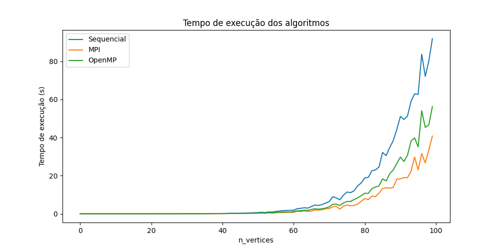

# Projeto de Supercomputação: Busca da Clique Máxima em Grafos

## Descrição
Este projeto tem como objetivo encontrar cliques máximas em grafos utilizando diferentes abordagens: sequencial, OpenMP e MPI. O algoritmo utilizado é recursivo com backtracking, iterando sobre cada nó do grafo e armazenando os resultados em um conjunto para eliminar repetições, este código sequencial encontra-se em `cpp\sequencial\exhaustion_seq.cpp`. 

Ao desenvolver o algoritimo basicamente escolhemos um nó e tentamos extender a clique com os vizinhos deste nó, se não for possível, removemos o nó e tentamos com outro nó. O algoritmo termina quando não é possível extender a clique com nenhum nó, ou seja, quando a clique é máxima. Fazendo isso para todos os nós do grafo, e tratando as repetições, encontramos todas as cliques máximas do grafo. Para finalizar basta encontrar dentre as cliques máximas a maior delas. Esta parte final em alto nivel seria apenas um `max()` com `chave=len()`. E como não estamos tratando estabilidade, esta parte O(n) foi desconsiderada nas medições de tempo. Para grafos muito grandes, talvez fosse interessante otimizar esta parte com mpi e veriamos ganhos no tempo de execução.

Finalmente, cada algoritimo foi validado com o codigo `verify.py` que verifica se o resultado encontrado é realmente a maior clique máxima antes de ser adaptado à nova versao descrita acima.

### OpenMP

O código encontrado em `cpp\openmp\exhaustion_omp.cpp` utiliza as diretivas do OpenMP para paralelizar certas partes do código.

No contexto desse código, `#pragma omp parallel` é usado para dividir o trabalho de encontrar cliques máximos entre diferentes threads, possibilitando uma execução mais rápida do que se fosse feita sequencialmente.

A diretiva `#pragma omp for` é usada para dividir as iterações de um loop `for` entre as threads. A cláusula `nowait` permite que as threads continuem a execução imediatamente após terminarem suas iterações, sem esperar pelas outras.

Aqui, `#pragma omp for nowait` é utilizada para distribuir as iterações do loop que percorre os vértices do grafo entre as threads, acelerando o processo de identificação de cliques.

`#pragma omp critical` é essencial neste código para garantir que, ao modificar o conjunto `cliquesMaximos` (uma operação não thread-safe), não ocorram condições de corrida, pois este conjunto é compartilhado entre todas as threads.

### MPI

O código encontrado em `cpp\mpi\exhaustion_mpi.cpp` distribui a leitura e processamento de diferentes grafos entre os processos MPI.
Cada processo lê e processa um subconjunto dos grafos. Isso é feito pelo loop `for (int v = world_rank; v < grafo.size(); v += world_size)`, onde cada processo começa em um vértice diferente e salta `world_size` vértices a cada iteração.
`MPI_Wtime` é uma função que retorna o tempo decorrido no relógio de parede do chamador MPI.
O código mede o tempo de processamento de cada grafo, calculando a diferença entre o tempo no início e no final do processamento.

## Amoastragem
Utilizamos um script Python `python\run.py` para gerar 100 grafos diferentes, onde o primeiro possui um nó e o último possui 100 nós. Este processo foi repetido 10 vezes, criando grafos em pastas separadas para fins de amostragem `graphs/`.

## Medição de Desempenho
Para cada conjunto de grafos, registramos os tempos de execução para cada algoritmo para cada grafo. Os resultados são armazenados em arrays de tamanho 100 contendo os tempos para encontrar todas as cliques maximas dos grafos de 1 a 100 nós, com 10 arrays para cada algoritmo representando os tempos de execução por amostragem. Uma média desses tempos é calculada para gerar um gráfico de desempenho `plot.py`. Essas medições brutas podem ser encontradas na pasta `results/`.

## Resultados
No final, apresentamos um gráfico com três curvas representando os tempos dos algoritmos sequencial, OpenMP e MPI. 

Aqui podemos observar que o algoritmo sequencial é o mais lento, seguido pelo OpenMP e MPI. O algoritmo sequencial é o mais lento pois não há paralelismo, enquanto o OpenMP e MPI são mais rápidos pois utilizam paralelismo. O MPI é mais rápido que o OpenMP pois o MPI distribui o trabalho entre diferentes processos, enquanto o OpenMP distribui o trabalho entre diferentes threads, e o MPI é mais eficiente que o OpenMP para este problema.

## Nota
A minha maquina local possui um processador com 6 cores e 12 cpus, por isso o OpenMP foi executado com 12 threads localmente assim como o algorítimo sequencial.
Ja o algoritimo MPI foi executado em uma VM Linux com 3 cores e 6 cpus, por isso foi executado com 6 processos.

Ou seja, caso o codigo MPI tivesse sido executado localmente com 12 processos, o tempo de execução seria ainda menor do que o apresentado no gráfico.

